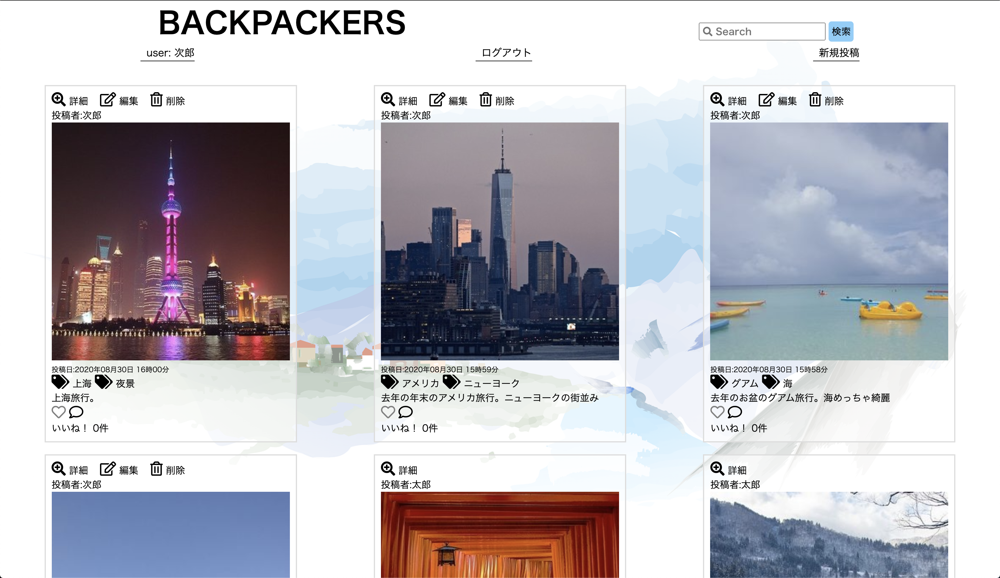
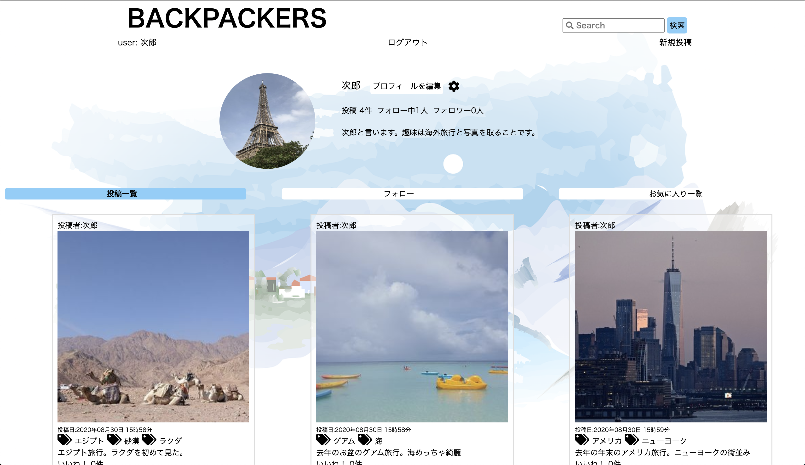
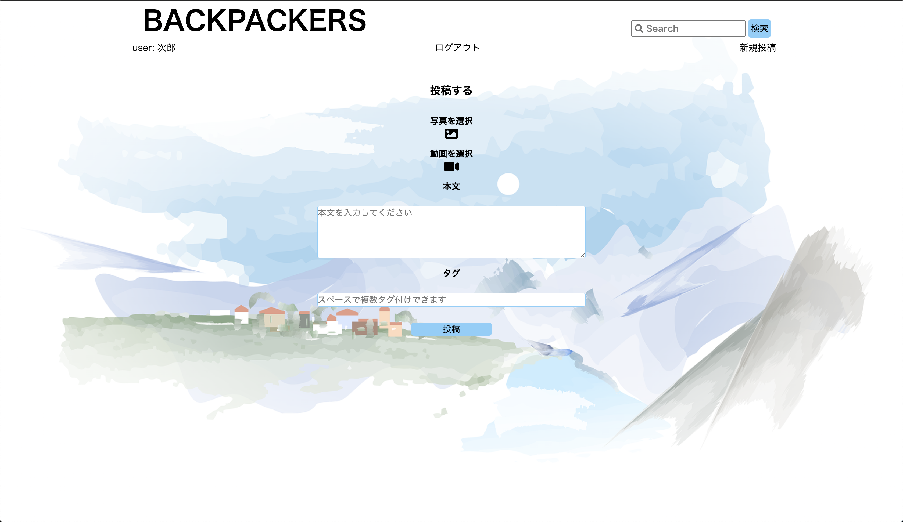
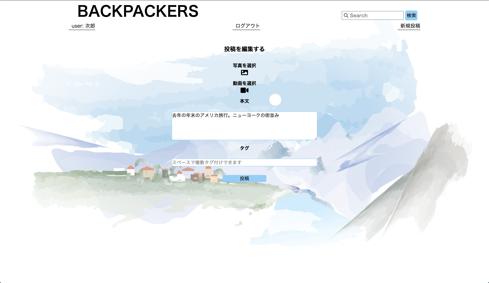
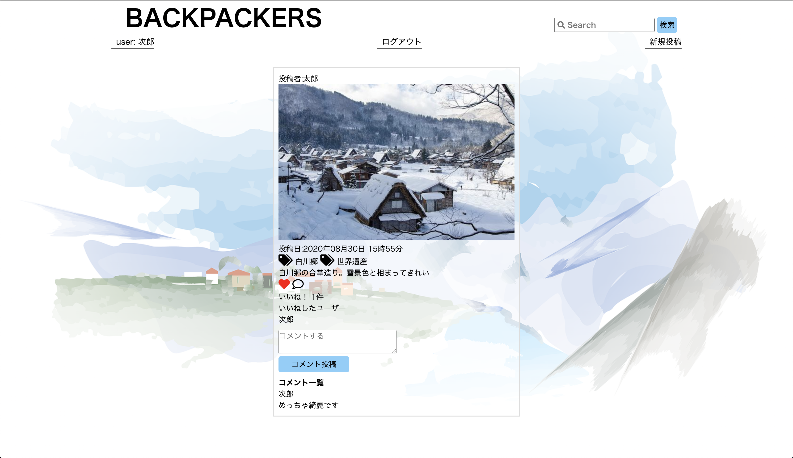
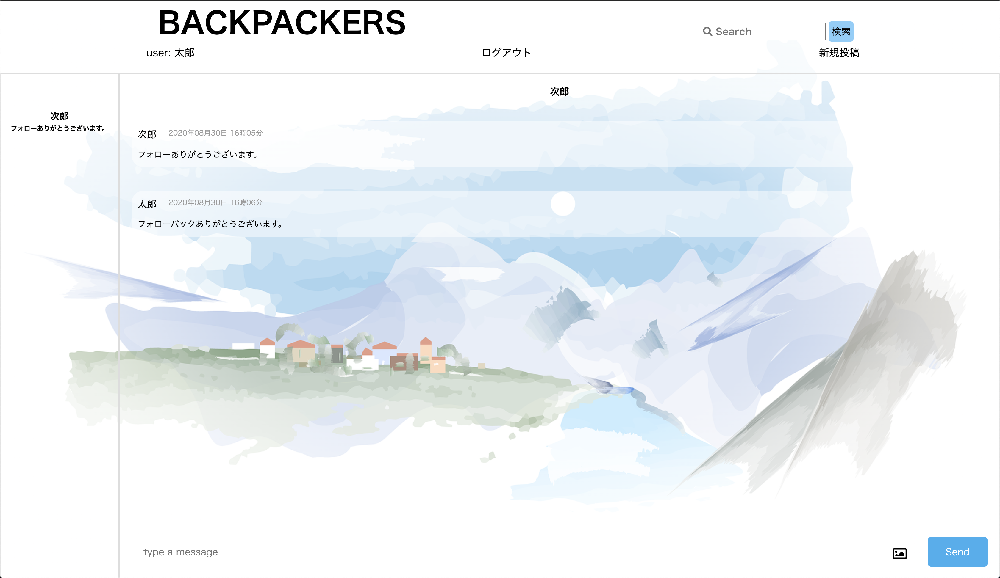

# BACKPACKERS
## 概要
旅行者向けのSNSサイトです。
### 使える機能
ユーザー登録、ログイン、ログアウト、画像の投稿、編集、削除、ユーザープロフィール、ユーザーアイコンの変更、フォロー機能、いいね機能、DM機能、投稿検索機能

## 本番環境
### 接続先情報
URL https://shi-ya-backpackers.herokuapp.com/
ID/Pass  
ID: takuya418  
Pass: takuya418  
テスト用アカウント  
メールアドレス: taro@gmail.com  
パスワード: 11111111  

## 開発状況
### 開発環境
Ruby/Ruby on Rails/PostgreSQL/Github/Heroku/AWS S3/Visual Studio Code

### 開発期間と平均作業時間
開発期間：7/23~8/3,8/21~30(22日間)  
1日あたりの平均作業時間：8時間

## 制作背景
私自身が旅行が好きなので旅行者専用のSNSがあれば、行きたい国や地域のことを調べたり、同じ国に行ったことがある人と繋がることや、旅行中に繋がることができると考えたから。  
また、コロナの影響で観光業が落ち込んでいるので応援する気持ちも込めて作成しました。

## デモ画像・動画
### トップページ

### マイページ

### 投稿ページ

### 編集ページ

### 投稿詳細ページ

### DMページ

## 工夫した点
タグつけする際に正規表現を用いて複数のタグを付けれるようにしたこと。
ビューをできるだけシンプルにして余計なものをなくしました。

## 課題と今後実装したい機能
### 課題
初期のデーターベール設計が不十分だったため追加でカラムの追加が起きていまいマイグレションファイルが増えてしまった。
ブランチを使わずにmasterで変更していますことが多々あった。
コミットを定期的にしていなく同じことを繰り返すことがあった。

### 今後実装したい機能
DMをフォロワー同士限定でできるように修正。
動画がローカル環境でしか投稿できない点を修正。
写真、動画の複数枚投稿を可能に。
カテゴリー機能（国と地域）の追加。
タグからも検索できるように修正。

## DB設計 
### user table
|Column|Type|Option|
|------|----|------|
|username|string|null: false|
|email|string|null: false|
|password|string|null: false|
|avater|string||
|introduction|string||

#### Association
- has_many :posts, dependent: :destroy
- has_many :comments
- has_many :likes, dependent: :destroy
- has_many :liked_posts, through: :likes, source: :post
- has_many :following_relationships,foreign_key: "follower_id", class_name: "FollowRelationship",  dependent: :destroy
- has_many :followings, through: :following_relationships
- has_many :follower_relationships,foreign_key: "following_id",class_name: "FollowRelationship", dependent: :destroy
- has_many :followers, through: :follower_relationships 
- has_many :messages, dependent: :destroy
- has_many :entries, dependent: :destroy

### comment table
|Column|Type|Option|
|------|----|------|
|text|text|null: false|
|user_id|integer|null: false, foreign_key: true|
|post_id|integer|null: false, foreign_key: true|
#### Association
- belongs_to :post
- belongs_to :user

### post table
|Column|Type|Option|
|------|----|------|
|text|text|null: false|
|image|string||
|video|string||
|user_id|integer|null: false, foreign_key: true|
#### Association
- has_many :comments
- has_many :post_tags, dependent: :destroy
- has_many :tags, through: :post_tags
- has_many :likes, dependent: :destroy
- has_many :liked_user, through: :likes, source: :user
- belongs_to :user

### post_tag table
|Column|Type|Option|
|------|----|------|
|post_id|integer|null: false, foreign_key: true|
|user_id|integer|null: false, foreign_key: true|
#### Association
- belongs_to :post
- belongs_to :tag

### tag table
|Column|Type|Option|
|------|----|------|
|name|string|uniqueness:true|
#### Association
- has_many :post_tags, dependent: :destroy
- has_many :posts, through: :post_tags

### like table
|Column|Type|Option|
|------|----|------|
|user_id|integer|null: false, foreign_key: true|
|post_id|integer|null: false, foreign_key: true|
#### Association
- belongs_to :user
- belongs_to :post

### follow_relationship table
|Column|Type|Option|
|------|----|------|
|follower_id|integer|null: false, foreign_key: true|
|following_id|integer|null: false, foreign_key: true|
#### Association
- belongs_to :follower, class_name: "User"
- belongs_to :following, class_name: "User"

### entry table
|Column|Type|Option|
|------|----|------|
|user_id|integer|null: false, foreign_key: true|
|room_id|integer|null: false, foreign_key: true|
#### Association
- belongs_to :room
- belongs_to :user

### room table
|Column|Type|Option|
|------|----|------|
|name|string||
#### Association
- has_many :messages, dependent: :destroy
- has_many :entries, dependent: :destroy

### message table
|Column|Type|Option|
|------|----|------|
|content|text|null: false|
|user_id|integer|null: false, foreign_key: true|
|room_id|integer|null: false, foreign_key: true|
#### Association
- belongs_to :room
- belongs_to :user

